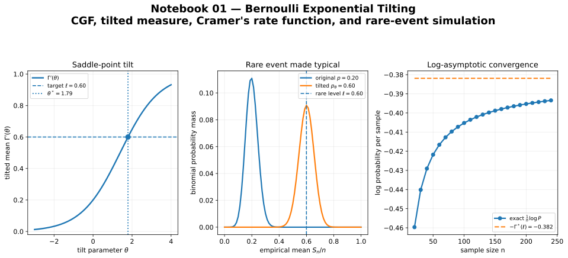

# large-deviations

[](https://github.com/sdfgaye/large-deviations/actions/workflows/tests.yml)

A research-style quantitative finance project on rare events, exponential tilting, and large-loss asymptotics.

This repository follows a simple workflow:

```text
Derive -> Code -> Apply
```

The goal is to build a clean bridge between large-deviation theory, numerical experiments, and quantitative finance applications.

## Featured notebook

The first notebook studies Bernoulli random variables as the elementary model for default indicators. It connects the cumulant generating function, exponential tilting, Cramer's rate function, exact binomial tail probabilities, and importance sampling diagnostics.

[Open notebook 01 — Bernoulli exponential tilting](notebooks/01_bernoulli_exponential_tilting.ipynb)



## Overview

Large deviations describe the exponential decay of rare-event probabilities. These questions appear naturally in quantitative finance when studying:

- tail risk,
- stress scenarios,
- rare default events,
- variance reduction,
- and risk management of large credit portfolios.

The project starts from foundational tools:

- cumulant generating functions,
- exponential change of measure,
- Fenchel-Legendre transforms,
- Cramer's theorem,
- importance sampling,

and moves toward a final implementation of extreme portfolio loss asymptotics in a one-factor Gaussian copula model.

## Final target

The long-term goal is to reproduce and implement the large-loss credit risk result for a homogeneous portfolio in a one-factor Gaussian copula setting:

```math
\lim_{n \to \infty} \frac{1}{\ln n}\ln \mathbb{P}(L_n \ge n q_n)
=
-a \frac{1-\rho^2}{\rho^2},
\qquad
q_n \uparrow 1,\quad 1-q_n = O(n^{-a}),\quad 0<a\le 1.
```

This result highlights a key phenomenon in credit risk:

> when dependence becomes more systemic, extreme losses become much less rare.

## How to run

Clone the repository and create a virtual environment:

```bash
git clone https://github.com/sdfgaye/large-deviations.git
cd large-deviations
python -m venv .venv
```

Activate the environment:

```bash
# macOS / Linux
source .venv/bin/activate

# Windows PowerShell
.venv\Scripts\Activate.ps1
```

Install the project with development and notebook dependencies:

```bash
python -m pip install --upgrade pip
pip install -e ".[dev,notebooks]"
```

Run the tests:

```bash
pytest
```

Launch the first notebook:

```bash
jupyter lab notebooks/01_bernoulli_exponential_tilting.ipynb
```

## Roadmap

### Module 0 — Foundations

- cumulant generating function $\Gamma(\theta)$
- exponential change of measure
- convexity and saddle-point intuition
- Fenchel-Legendre transform
- Bernoulli distribution implementation

### Module 1 — Cramer's theorem

- exact binomial rare-event probabilities
- logarithmic asymptotics
- empirical verification of the rate function

### Module 2 — Importance sampling

- rare-event Monte Carlo estimation
- exponential tilting
- second-moment diagnostics
- asymptotically optimal importance sampling

### Module 3 — Gartner-Ellis

- limiting cumulant generating functions
- extension beyond i.i.d. models
- bridge toward dependent credit models

### Module 4 — Credit portfolio risk

- homogeneous default portfolio
- one-factor Gaussian copula
- extreme loss asymptotics
- two-step importance sampling

## Theory notes

### Foundations

- [Exponential tilting and importance sampling](docs/foundations/exponential_tilting.md)

### Distributions

- [Bernoulli distribution](docs/distributions/bernoulli.md)

## Repository structure

```text
large-deviations/
|-- README.md
|-- pyproject.toml
|-- requirements.txt
|-- notebooks/
|-- src/
|   `-- large_deviations/
|-- tests/
|-- docs/
|-- assets/
`-- .github/workflows/
```

## Current status

- [x] Project initialized
- [x] Packaging scaffold in place
- [x] GitHub Actions test workflow
- [x] Foundations module
- [x] Distribution abstraction with `DistributionLD`
- [x] Bernoulli implementation
- [x] Bernoulli tests
- [x] Exponential tilting helpers in `tilting.py`
- [x] Plotting helpers in `plotting.py`
- [x] Exponential tilting theory note
- [x] Bernoulli theory note
- [x] Notebook 01: Bernoulli exponential tilting
- [ ] Cramer theorem module
- [ ] Importance sampling module
- [ ] Additional distribution examples
- [ ] Credit portfolio final module

## Tech stack

- Python 3.10+
- NumPy
- SciPy
- Pandas
- Matplotlib
- JupyterLab
- ipywidgets
- pytest

## Project philosophy

This is not meant to be a loose collection of notebooks.

The goal is to build a repository that is:

- mathematically rigorous,
- readable,
- reproducible,
- modular,
- and useful as a long-term research / portfolio project.

Each piece of code should trace back to a clear mathematical object, and each notebook should explain why the implementation matters.

## Reference

H. Pham, *Large Deviations in Mathematical Finance* (2010).

## Author

**Souleymane Gaye**