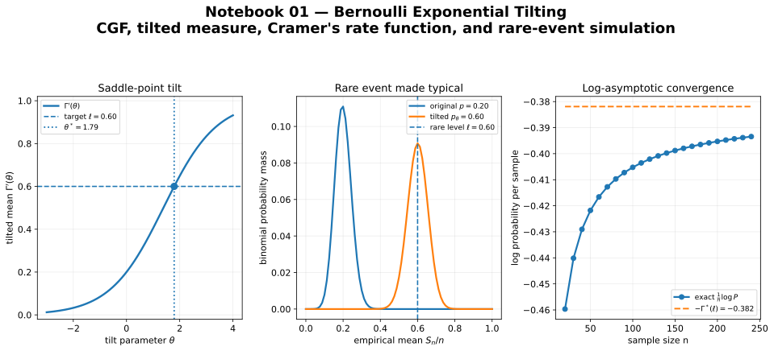
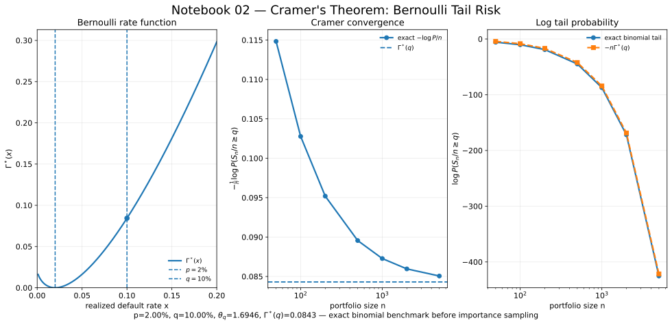

# large-deviations

[](https://github.com/sdfgaye/large-deviations/actions/workflows/tests.yml)

A research-style quantitative finance project on rare events, exponential tilting, and large-loss asymptotics, following H. Pham, *Large Deviations in Mathematical Finance* (2010).

Each part of the project starts from a mathematical object, implements it in a small tested Python package, and connects it to rare-event or credit-risk intuition through a notebook.

## Notebooks

### 01 — Bernoulli exponential tilting

Bernoulli random variables as the elementary model for default indicators: cumulant generating function, exponential change of measure, tilted Bernoulli probabilities, and the saddle-point intuition behind rare-event simulation.

[Open notebook 01](notebooks/01_bernoulli_exponential_tilting.ipynb)



### 02 — Cramer's theorem for Bernoulli tail risk

Numerical verification of Cramer's theorem in the Bernoulli/binomial setting: exact binomial tail probabilities against the large-deviation approximation on a logarithmic scale, interpreted as a large realized default rate in an independent credit portfolio.

[Open notebook 02](notebooks/02_cramer_bernoulli_tail_risk.ipynb)



### 03 — Bernoulli importance sampling

From theory to computation: naive Monte Carlo versus exponentially tilted importance sampling for rare binomial tail events, with likelihood-ratio diagnostics and variance comparisons against the exact benchmark.

[Open notebook 03](notebooks/03_bernoulli_importance_sampling.ipynb)

## Final target

The end goal is the large-loss asymptotic for a homogeneous portfolio in a one-factor Gaussian copula model:

```math
\lim_{n \to \infty} \frac{1}{\ln n}\ln \mathbb{P}(L_n \ge n q_n)
=
-a \frac{1-\rho^2}{\rho^2},
\qquad
q_n \uparrow 1,\quad 1-q_n = O(n^{-a}),\quad 0<a\le 1.
```

When dependence becomes more systemic, extreme losses become much less rare — the tail probability decays polynomially in $n$ instead of exponentially.

## Status

The foundations (CGF, Fenchel-Legendre transform, tilting helpers), the Bernoulli distribution, Cramer's theorem experiments, and the importance sampling module are implemented, tested, and covered by notebooks 01–03. The credit module (`src/large_deviations/credit/`) already contains the one-factor Gaussian copula tools, the quadrature benchmark, and the large-loss decay-rate computations; the accompanying notebook 04 is in progress. Still to come: a Gartner-Ellis bridge beyond the i.i.d. case and two-step importance sampling for the dependent portfolio.

## How to run

```bash
git clone https://github.com/sdfgaye/large-deviations.git
cd large-deviations
python -m venv .venv
```

Activate the environment:

```bash
# macOS / Linux
source .venv/bin/activate

# Windows PowerShell
.venv\Scripts\Activate.ps1
```

Install with development and notebook dependencies, then run the tests:

```bash
python -m pip install --upgrade pip
pip install -e ".[dev,notebooks]"
pytest
```

Launch the first notebook:

```bash
jupyter lab notebooks/01_bernoulli_exponential_tilting.ipynb
```

## Theory notes

Foundations:

- [Exponential tilting and importance sampling](docs/foundations/exponential_tilting.md)
- [Cramer's theorem from scratch](docs/foundations/cramers_theorem_from_scratch.md)

Distributions:

- [Bernoulli distribution](docs/distributions/bernoulli.md)

Credit risk:

- [Copulas from scratch](docs/credit/copulas_from_scratch.md)
- [One-factor Gaussian copula](docs/credit/one_factor_gaussian_copula.md)

## Reference

H. Pham, *Large Deviations in Mathematical Finance* (2010).

## Author

Souleymane Gaye
